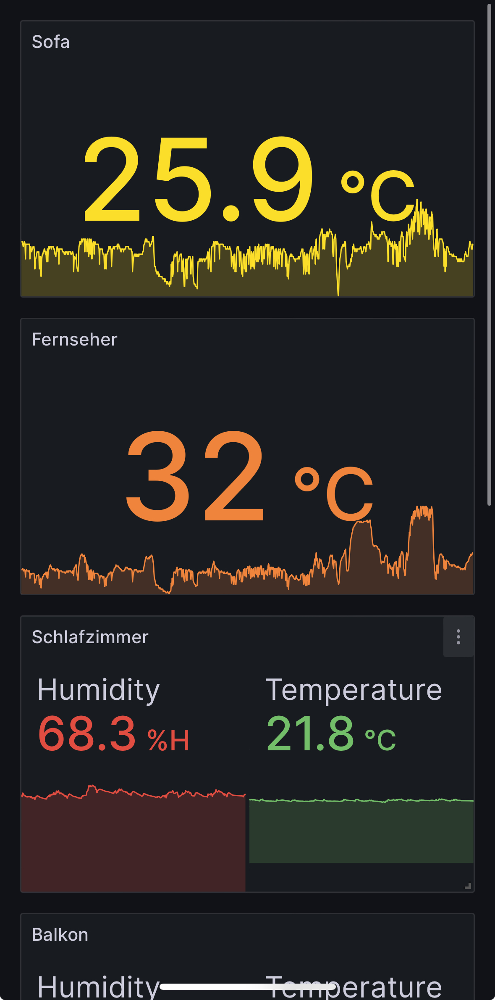
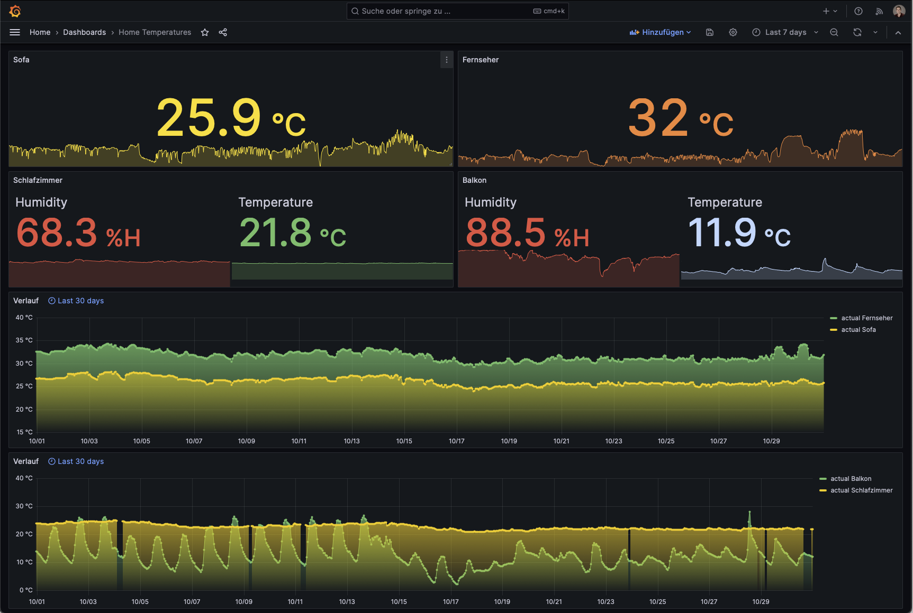

# SmartGadget-Reader
This is a simple python project to read out the Sensirion SmartGadget BLE sensors and send data to InfluxDB.

> :warning: This project is very much a work in Progress and a lot is undocumented yet. You can follow the progress 
> here: https://git.damutten.ch/Nicolas/SmartGadget-Reader/pulls/1

## General Architecture

This project is designed to run on a Raspberry Pi. It uses the `bluepy` library to connect to the SmartGadget and send 
it's data periodically to InfluxDB. Then Grafana can be used to visualize the data.

Have some Screenshots:

### Directly on iPhone

### On a Desktop

## Requirements

- A Raspberry Pi with Bluetooth and a running linux installation => the project only runs on linux
- A Sensirion SmartGadget (Only tested with SHT40)
- A running InfluxDB instance  
  Refer to its documentation on how to set it up (be sure to use v2 OSS): https://docs.influxdata.com/influxdb/v2/
- A running Grafana instance  
  Refer to its documentation on how to set it up: https://grafana.com/docs/grafana/latest/installation/

## Limitations

- Due to using bluepy:
  - this project only runs on linux
  - the project can't full use asyncio
  - Guess/Unverified: Only one SmartGadget can be connected at a time
  - Unfinished: Bluetooth Low Energy notifications are not used/will not work with multiple SmartGadgets

## Installation
_TBD_: Currently it runs on a frankensteind poetry environment. pyproject.toml should include all necessary 
dependencies but poetry is really not working well on a Raspberry Pi (probably due to the arm architecture…).

## InfluxDB Setup

_TBD_: Buckets and Data Structure
